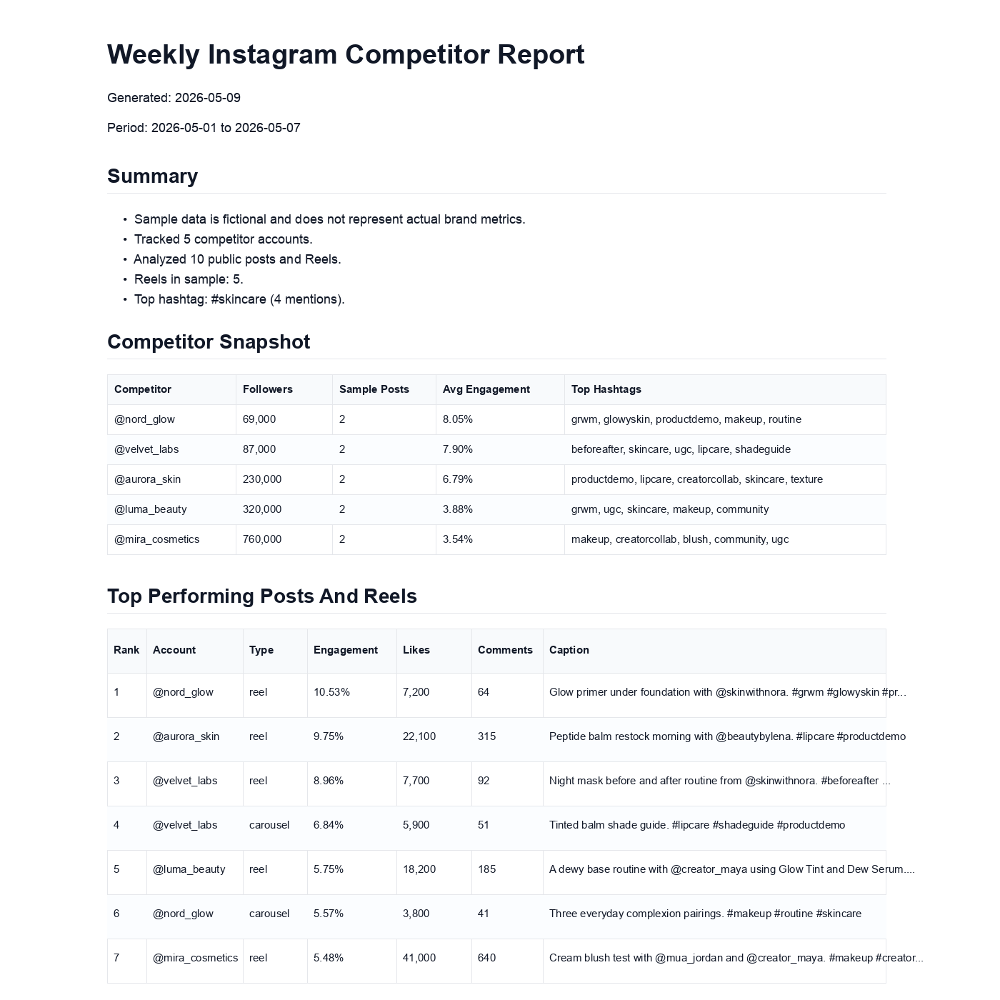

# Instagram Competitor Intelligence


Generate weekly Instagram competitor reports with Python.

Track public brand accounts, rank top-performing Reels, extract hashtag trends, detect creator mentions, and export client-ready Markdown / HTML reports.

> Built for developers, agencies, DTC brands, and social media analysts who want to turn public Instagram data into repeatable competitor insights.

This is not an Instagram API wrapper and it is not an automation bot. It is a practical open-source starter for turning public Instagram data into competitor reports.



## What You Can Build

- Weekly competitor reports for brands or agency clients
- Reels performance rankings
- Hashtag trend summaries
- Creator and influencer mention research
- CSV exports for spreadsheets and dashboards
- Scheduled reports with GitHub Actions or cron

## Quick Start

Run the sample report with mock data first. No API key is required.

Clone the repo:

```bash
git clone https://github.com/prodkit-labs/instagram-competitor-intelligence.git
cd instagram-competitor-intelligence
```

Install dependencies:

```bash
pip install -r requirements.txt
```

Run with mock data:

```bash
python3 examples/06_generate_weekly_report.py --mock
```

Generated reports:

```text
reports/sample_weekly_report.md
reports/sample_weekly_report.html
```

Optional syntax check:

```bash
python3 -m compileall examples src
```

## Example Output

See:

- [reports/sample_weekly_report.md](reports/sample_weekly_report.md)
- [reports/sample_weekly_report.html](reports/sample_weekly_report.html)

The report includes:

- competitor activity summary
- top posts and Reels
- hashtag trends
- creator mentions
- practical recommendations
- raw CSV-friendly metrics

## Recipes

Start with recipe 06 if you want the fastest end-to-end demo.

| Goal | Recipe |
| --- | --- |
| Generate a full weekly competitor report | `examples/06_generate_weekly_report.py` |
| Rank top-performing Reels and posts | `examples/03_rank_top_reels.py` |
| Compare multiple competitor accounts | `examples/05_compare_competitors.py` |
| Extract hashtag trends | `examples/04_extract_hashtags.py` |
| Find creator and brand mentions | `examples/09_extract_creator_mentions.py` |
| Export metrics to CSV | `examples/07_export_csv.py` |
| Schedule recurring reports | `examples/08_schedule_with_github_actions.md` |
| Estimate API request usage | `examples/10_estimate_api_cost.py` |
| Structure an agency client report | `examples/11_agency_report_template.md` |
| Fetch recent public posts and Reels | `examples/02_get_recent_media.py` |
| Get public profile fields | `examples/01_get_profile.py` |

## Data Sources and Provider Setup

This project runs with mock data by default, so you can try it without any API key.

For real public Instagram data, use a provider adapter. The first adapter included in this repo is HikerAPI, and you can also implement your own provider by following `src/providers/base.py`.

- Mock data: free, no API key
- HikerAPI: included public-data provider adapter
- Custom provider: bring your own API or data source

For production decision notes, see:

- [docs/production/provider-comparison.md](docs/production/provider-comparison.md)
- [docs/production/cost-control.md](docs/production/cost-control.md)
- [docs/production/deployment.md](docs/production/deployment.md)
- [benchmarks/README.md](benchmarks/README.md)

## When to Use a Real Data Provider

Mock data is useful for learning the workflow.

Use a real public-data provider when you want to:

- monitor real competitor accounts
- refresh reports weekly or daily
- export live posts and Reels data
- build dashboards for clients or internal teams
- compare public brand accounts over time

## Use Real API Data

Copy the environment example:

```bash
cp .env.example .env
```

Add your API key:

```text
INSTAGRAM_DATA_PROVIDER=hikerapi
HIKERAPI_KEY=your_api_key_here
```

Then run:

```bash
python3 examples/06_generate_weekly_report.py
```

## Production Notes

- Use mock data first.
- Start with small account lists.
- Estimate API usage before scheduling jobs.
- Cache data where possible.
- Do not commit API keys.
- Compare providers in the production docs before scaling scheduled runs.

## Ethical Use

This project is for public data analysis and reporting. Do not use it for:

- private account data
- Instagram credential collection
- auto-DM, spam, scraping abuse, fake engagement, or account automation
- claiming official affiliation with Instagram, Meta, or any data provider

## Roadmap

- [x] Mock data workflow
- [x] Weekly Markdown / HTML report
- [x] Reels and post engagement ranking
- [x] Hashtag trend extraction
- [x] Creator mention extraction
- [x] GitHub Actions scheduling example
- [ ] Streamlit dashboard demo
- [ ] Google Sheets export guide
- [ ] Notion report template
- [ ] Multi-client agency report template
- [ ] TikTok / YouTube Shorts competitor workflow

## Need Help?

Open an issue or discussion with the workflow you are trying to build. Keep requests focused on public data analysis and reporting.
